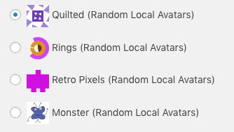
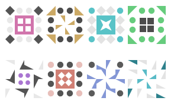
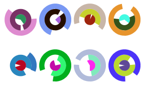
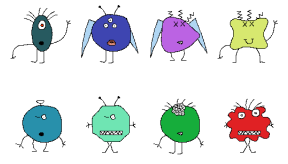

# Random Local Avatars

WordPress plugin that acts as a local replacement for Gravatars.

Works with the Simple Local Avatars plugin.

## How To Use

1. Download the plugin
1. Unzip it to your WordPress plugins folder
1. **If not installed w/ composer** - Navigate to the plugin directory and run `composer install`
1. Enable this plugin
1. Visit Dashboard > Settings > Discussion
1. Select desired avatar style

## Avatar Styles

### Retro Pixels - Identicon

Uses [yzalis/Identicon](https://github.com/yzalis/Identicon) library.

### Quilted - Jdenticon

Uses [dmester/jdenticon-php](https://github.com/dmester/jdenticon-php) library.

### Rings

Based on [splitbrain/php-ringicon](https://github.com/splitbrain/php-ringicon).

### MonsterID 

Uses [sandfoxme/monsterid](https://github.com/sandfoxme/monsterid) library.

